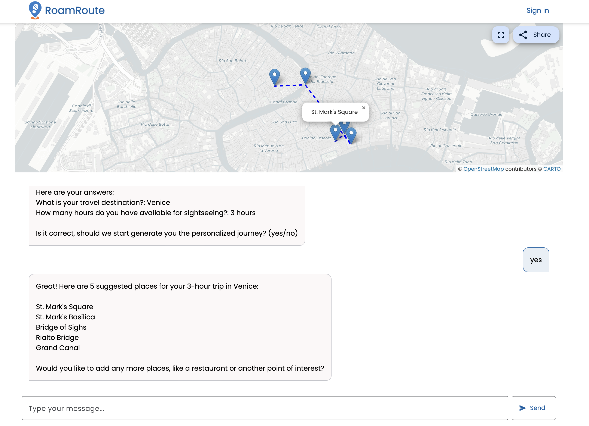

# 🗺️ RoamRoute - AI-Powered Travel Route Planner

RoamRoute is an application that helps international tourists quickly generate **optimized one-day sightseeing routes** in new cities. 

Users answer a few questions through an **AI chat** interface, and the app creates a personalized walking tour, displaying it on an interactive map with shareable functionality.



**🌐 Live Demo:** [https://roam-route.netlify.app/](https://roam-route.netlify.app/)

---

**📚 Course Project:** This project was created as part of the [10xdevs.pl](https://www.10xdevs.pl/) course - a comprehensive web development program focusing on working with AI tools to improve the efficiency

---

## ✨ Features

- **AI-Powered Route Planning**: Interactive chat interface using Google Gemini AI for personalized route generation
- **Interactive Maps**: Beautiful route visualization with Leaflet maps and animated polylines
- **Community Sharing**: Save and share routes with other travelers
- **User Authentication**: Secure Firebase authentication with Google sign-in
- **Route Exploration**: Discover routes created by the community
- **Responsive Design**: Optimized for desktop experience

## 🛠️ Tech Stack

### Frontend
- **Astro 5** - Static site generator with island architecture
- **Angular 19 (AnalogJS)** - Interactive components using standalone architecture
- **TypeScript 5** - Type-safe development
- **Tailwind CSS 4** - Utility-first CSS framework
- **Angular Material** - UI component library

### Backend & Services
- **Firebase Authentication** - Secure user authentication
- **Firebase Firestore** - NoSQL database for routes and user data
- **Google Gemini AI (Genkit)** - Conversational AI for route planning
- **Leaflet** - Interactive map visualization

### Testing & Quality
- **Playwright** - End-to-end testing
- **Vitest** - Unit testing
- **ESLint** - Code linting
- **Feature-Sliced Design (FSD)** - Architectural methodology

## 🚀 Getting Started

### Prerequisites

- Node.js (v18 or higher)
- pnpm package manager

### Installation

1. **Install dependencies**
   ```bash
   pnpm install
   ```

2. **Set up environment variables**
   
   Create a `.env` file in the `app` directory with the variables given at `.env.example`

4. **Start the development server**
   ```bash
   pnpm dev
   ```

   The application will be available at `http://localhost:4321`

## 📁 Project Structure

The project follows Feature-Sliced Design (FSD) methodology:

```
app/src/
├── features/          # Feature-based modules
│   ├── auth/         # Authentication components
│   ├── chat/         # AI chat interface
│   ├── explore/      # Community routes exploration
│   ├── map/          # Map visualization
│   └── planner/      # Route planning
├── services/         # Business logic and API calls
├── shared/           # Reusable components
├── layouts/          # Astro layouts
├── pages/            # Astro pages and API routes
├── contexts/         # AI prompt contexts
└── app/              # App configuration
```

## 🧪 Testing

### End-to-End Tests
```bash
pnpm test
```

The E2E tests cover:
- User authentication flow
- Route generation and planning
- Community route exploration
- Map interaction and visualization

## 🚀 Deployment

The application is automatically deployed to Netlify when changes are pushed to the main branch. The deployment configuration is defined in `netlify.toml`.

---

**Built with ❤️ as part of [10xdevs.pl](https://www.10xdevs.pl/) course**
